# Diagram Architektury UI - Moduł Autentykacji 10xCards

## Analiza Architektury

<architecture_analysis>

### 1. Komponenty wymienione w plikach referencyjnych

#### ISTNIEJĄCE KOMPONENTY:
**Nawigacja:**
- `Header.tsx` - Główny nagłówek aplikacji
- `NavLinks.tsx` - Lista linków nawigacyjnych
- `MobileNav.tsx` - Menu mobilne
- `NavLink.tsx` - Pojedynczy link z aktywnym stanem
- `Logo.tsx` - Logo aplikacji

**Dashboard:**
- `Dashboard.tsx` - Główny komponent dashboardu
- `DashboardAuthLinks.tsx` - Przyciski Login/Register
- `DashboardWithProvider.tsx` - Provider wrapper
- `DashboardHero.tsx` - Sekcja hero
- `DashboardActions.tsx` - Akcje główne
- `PrimaryActionButton.tsx` - Przycisk głównej akcji

**Store i Hooks:**
- `auth.store.ts` - Zustand store dla autentykacji
- `useAuth.ts` - Hook do zarządzania auth

**Utilities:**
- `auth.utils.ts` - Utility'e autentykacji
- `response.utils.ts` - Utility'e odpowiedzi API
- `client.ts` - API client z JWT
- `auth.api.ts` - Funkcje API auth
- `env.config.ts` - Konfiguracja środowiska

**Middleware:**
- `middleware/index.ts` - Ochrona tras

**API Endpoints (istniejące):**
- `/api/auth/session.ts` - GET sesji użytkownika

#### PLANOWANE KOMPONENTY:

**Strony Astro:**
- `login.astro` - Strona logowania
- `register.astro` - Strona rejestracji
- `settings.astro` - Ustawienia konta
- `forgot-password.astro` - Odzyskiwanie hasła (OPCJONALNY)
- `reset-password.astro` - Reset hasła (OPCJONALNY)

**Komponenty Auth:**
- `LoginFormWithProvider.tsx` - Provider formularza logowania
- `LoginForm.tsx` - Formularz logowania
- `RegisterFormWithProvider.tsx` - Provider rejestracji
- `RegisterForm.tsx` - Formularz rejestracji
- `ForgotPasswordFormWithProvider.tsx` - Provider zapomniałem hasła
- `ForgotPasswordForm.tsx` - Formularz odzyskiwania
- `ResetPasswordFormWithProvider.tsx` - Provider reset hasła
- `ResetPasswordForm.tsx` - Formularz resetu
- `FormAlert.tsx` - Alerty formularzy

**Komponenty Settings:**
- `SettingsPageWithProvider.tsx` - Provider ustawień
- `SettingsPage.tsx` - Strona ustawień
- `ChangePasswordForm.tsx` - Zmiana hasła
- `DeleteAccountSection.tsx` - Usunięcie konta

**Komponenty nawigacyjne:**
- `UserMenu.tsx` - Menu użytkownika (dropdown)

**API Endpoints (planowane):**
- `/api/auth/register.ts` - POST rejestracja
- `/api/auth/login.ts` - POST logowanie
- `/api/auth/logout.ts` - POST wylogowanie
- `/api/auth/forgot-password.ts` - POST odzyskiwanie hasła
- `/api/auth/reset-password.ts` - POST reset hasła
- `/api/auth/change-password.ts` - POST zmiana hasła
- `/api/auth/account.ts` - DELETE usunięcie konta

**Schematy walidacji:**
- `auth.schema.ts` - Zod schematy dla auth

**Komponenty UI do dodania:**
- `Avatar` - Avatar użytkownika
- `DropdownMenu` - Menu dropdown
- `Tabs` - Zakładki

### 2. Główne strony i ich komponenty

**A. Strona Logowania (/login)**
- Layout.astro
  - LoginFormWithProvider
    - LoginForm
      - Input (email, hasło)
      - Button (Zaloguj się)
      - FormAlert (błędy)
    - useAuth hook
    - loginSchema (Zod)

**B. Strona Rejestracji (/register)**
- Layout.astro
  - RegisterFormWithProvider
    - RegisterForm
      - Input (email, hasło, potwierdź hasło)
      - Button (Zarejestruj się)
      - FormAlert (błędy)
    - useAuth hook
    - registerSchema (Zod)

**C. Strona Ustawień (/settings)**
- Layout.astro
  - SettingsPageWithProvider
    - SettingsPage
      - Tabs (Zmiana hasła, Usunięcie konta)
      - ChangePasswordForm
        - Input (stare hasło, nowe hasło)
        - Button (Zmień hasło)
      - DeleteAccountSection
        - AlertDialog
        - Input (hasło)
        - Button (Usuń konto)

**D. Dashboard (/)**
- Layout.astro
  - DashboardWithProvider
    - Dashboard
      - DashboardHero
      - DashboardActions
      - DashboardAuthLinks (dla niezalogowanych)
    - useAuth hook

**E. Nawigacja (globalna)**
- Header
  - Logo
  - NavLinks
  - UserMenu (dla zalogowanych)
    - Avatar
    - DropdownMenu
      - Link (Ustawienia)
      - Button (Wyloguj)
  - DashboardAuthLinks (dla niezalogowanych)
  - MobileNav

### 3. Przepływ danych między komponentami

**Przepływ autentykacji (Logowanie):**
1. Użytkownik → LoginForm (input email, hasło)
2. LoginForm → Walidacja (loginSchema)
3. LoginForm → POST /api/auth/login
4. API → Supabase Auth → Weryfikacja
5. API → Response (JWT token + user data)
6. LoginForm → auth.store.login()
7. auth.store → Update state (user, isAuthenticated)
8. auth.store → Zapisanie tokena w Supabase client
9. LoginForm → Przekierowanie na dashboard lub redirectTo

**Przepływ autentykacji (Rejestracja):**
1. Użytkownik → RegisterForm (email, hasło, potwierdź)
2. RegisterForm → Walidacja (registerSchema)
3. RegisterForm → POST /api/auth/register
4. API → Supabase Auth → Utworzenie konta
5. API → Response (sukces, requiresEmailConfirmation?)
6. RegisterForm → Automatyczne logowanie (US-001)
7. auth.store → Update state
8. RegisterForm → Przekierowanie na dashboard

**Przepływ inicjalizacji:**
1. App mount → useAuth hook
2. useAuth → auth.store.initialize()
3. auth.store → GET /api/auth/session
4. API → Weryfikacja JWT lub DEFAULT_USER_ID
5. API → Response (user data)
6. auth.store → Update state
7. Komponenty → Re-render z nowym stanem

**Przepływ middleware:**
1. Request → middleware/index.ts
2. Middleware → Sprawdzenie chronionej trasy
3. Middleware → Pobranie sesji z Supabase
4. Middleware → locals.user = user data
5. Middleware → Redirect na /login?redirect={path} (jeśli niezalogowany)
6. Middleware → next() (jeśli zalogowany)

**Przepływ wylogowania:**
1. UserMenu → Click "Wyloguj"
2. UserMenu → auth.store.logout()
3. auth.store → POST /api/auth/logout
4. API → Supabase Auth → signOut()
5. auth.store → Clear state
6. auth.store → Przekierowanie na /

### 4. Opis funkcjonalności komponentów

**WARSTWA PREZENTACJI (Strony Astro):**
- `login.astro` - Server-side rendering strony logowania, obsługa parametru redirect
- `register.astro` - Server-side rendering rejestracji
- `settings.astro` - Server-side rendering ustawień (chroniona trasa)
- `forgot-password.astro` - Server-side rendering odzyskiwania hasła (OPCJONALNY)
- `reset-password.astro` - Server-side rendering resetu hasła z tokenem (OPCJONALNY)

**WARSTWA KOMPONENTÓW REACT:**

*Komponenty formularzy:*
- `LoginForm` - Formularz logowania, walidacja Zod, wywołanie API, obsługa błędów
- `RegisterForm` - Formularz rejestracji, walidacja, auto-login po sukcesie
- `ForgotPasswordForm` - Żądanie linku resetującego
- `ResetPasswordForm` - Ustawienie nowego hasła z tokenem
- `ChangePasswordForm` - Zmiana hasła dla zalogowanych
- `DeleteAccountSection` - Dialog potwierdzenia usunięcia konta

*Komponenty Provider:*
- `*WithProvider` - Wrappers dla formularzy z React Hook Form context

*Komponenty nawigacyjne:*
- `Header` - Główny nagłówek z logo, linkami, UserMenu
- `NavLinks` - Lista linków do stron (Dashboard, Fiszki, Generuj, Ucz się)
- `UserMenu` - Dropdown menu z avatarem, linkiem do ustawień, opcją wylogowania
- `MobileNav` - Responsywne menu mobilne

*Komponenty pomocnicze:*
- `FormAlert` - Wyświetlanie alertów (error, success, warning)

**WARSTWA LOGIKI (Stores & Hooks):**
- `auth.store` - Zustand store, zarządzanie stanem auth (user, isAuthenticated, isLoading, error)
- `useAuth` - Hook do dostępu do stanu, automatyczna inicjalizacja

**WARSTWA API:**

*Endpoints:*
- `POST /api/auth/register` - Rejestracja, walidacja, Supabase Auth signup
- `POST /api/auth/login` - Logowanie, zwrócenie JWT tokena
- `POST /api/auth/logout` - Wylogowanie, unieważnienie sesji
- `GET /api/auth/session` - Pobranie aktualnej sesji
- `POST /api/auth/change-password` - Zmiana hasła (wymaga JWT)
- `DELETE /api/auth/account` - Usunięcie konta (wymaga JWT i hasła)
- `POST /api/auth/forgot-password` - Żądanie resetu (OPCJONALNY)
- `POST /api/auth/reset-password` - Reset hasła (OPCJONALNY)

*Utilities:*
- `auth.utils` - extractBearerToken, verifyToken, checkGenerationPermission
- `response.utils` - createErrorResponse, createSuccessResponse, mapSupabaseAuthError
- `client.ts` - API client z automatycznym wstrzykiwaniem JWT tokena
- `auth.api.ts` - getAuthSession()

**WARSTWA WALIDACJI:**
- `auth.schema.ts` - Zod schematy (loginSchema, registerSchema, changePasswordSchema, deleteAccountSchema)

**WARSTWA MIDDLEWARE:**
- `middleware/index.ts` - Ochrona tras, weryfikacja JWT, ustawianie locals.user, przekierowania

**WARSTWA INTEGRACJI:**
- `supabase.client.ts` - Supabase client z obsługą PUBLIC_ zmiennych
- `database.types.ts` - TypeScript types z Supabase schema

</architecture_analysis>

---

## Diagram Mermaid - Architektura UI Modułu Autentykacji

```mermaid
flowchart TD
    subgraph "WARSTWA UŻYTKOWNIKA"
        Browser["🌐 Przeglądarka"]
    end

    subgraph "STRONY ASTRO - SSR"
        IndexPage["index.astro<br/>(Dashboard)<br/>✓ ISTNIEJE"]
        LoginPage["login.astro<br/>(Logowanie)<br/>⚠️ PLANOWANY"]
        RegisterPage["register.astro<br/>(Rejestracja)<br/>⚠️ PLANOWANY"]
        SettingsPage["settings.astro<br/>(Ustawienia)<br/>⚠️ PLANOWANY<br/>🔒 CHRONIONA"]
        ForgotPage["forgot-password.astro<br/>(Odzyskiwanie)<br/>⚠️ OPCJONALNY"]
        ResetPage["reset-password.astro<br/>(Reset hasła)<br/>⚠️ OPCJONALNY"]
    end

    subgraph "LAYOUT"
        Layout["Layout.astro<br/>✓ ISTNIEJE"]
        Header["Header.tsx<br/>✓ ISTNIEJE"]
    end

    subgraph "KOMPONENTY NAWIGACYJNE"
        Logo["Logo.tsx<br/>✓ ISTNIEJE"]
        NavLinks["NavLinks.tsx<br/>✓ ISTNIEJE"]
        MobileNav["MobileNav.tsx<br/>✓ ISTNIEJE"]
        UserMenu["UserMenu.tsx<br/>⚠️ PLANOWANY"]
        DashboardAuthLinks["DashboardAuthLinks.tsx<br/>✓ ISTNIEJE"]
    end

    subgraph "KOMPONENTY DASHBOARD"
        DashboardProvider["DashboardWithProvider.tsx<br/>✓ ISTNIEJE"]
        Dashboard["Dashboard.tsx<br/>✓ ISTNIEJE"]
        DashboardHero["DashboardHero.tsx<br/>✓ ISTNIEJE"]
        DashboardActions["DashboardActions.tsx<br/>✓ ISTNIEJE"]
    end

    subgraph "KOMPONENTY AUTH FORMULARZY"
        LoginProvider["LoginFormWithProvider.tsx<br/>⚠️ PLANOWANY"]
        LoginForm["LoginForm.tsx<br/>⚠️ PLANOWANY"]
        RegisterProvider["RegisterFormWithProvider.tsx<br/>⚠️ PLANOWANY"]
        RegisterForm["RegisterForm.tsx<br/>⚠️ PLANOWANY"]
        ForgotProvider["ForgotPasswordFormWithProvider.tsx<br/>⚠️ OPCJONALNY"]
        ForgotForm["ForgotPasswordForm.tsx<br/>⚠️ OPCJONALNY"]
        ResetProvider["ResetPasswordFormWithProvider.tsx<br/>⚠️ OPCJONALNY"]
        ResetForm["ResetPasswordForm.tsx<br/>⚠️ OPCJONALNY"]
        FormAlert["FormAlert.tsx<br/>⚠️ PLANOWANY"]
    end

    subgraph "KOMPONENTY SETTINGS"
        SettingsProvider["SettingsPageWithProvider.tsx<br/>⚠️ PLANOWANY"]
        SettingsComp["SettingsPage.tsx<br/>⚠️ PLANOWANY"]
        ChangePasswordForm["ChangePasswordForm.tsx<br/>⚠️ PLANOWANY"]
        DeleteAccountSection["DeleteAccountSection.tsx<br/>⚠️ PLANOWANY"]
    end

    subgraph "KOMPONENTY UI - SHADCN"
        Input["Input"]
        Button["Button"]
        Alert["Alert"]
        Dialog["Dialog"]
        Form["Form"]
        Card["Card"]
        Avatar["Avatar<br/>⚠️ DO DODANIA"]
        DropdownMenu["DropdownMenu<br/>⚠️ DO DODANIA"]
        Tabs["Tabs<br/>⚠️ DO DODANIA"]
    end

    subgraph "WARSTWA STANU"
        AuthStore["auth.store.ts<br/>(Zustand)<br/>✓ ISTNIEJE"]
        UseAuth["useAuth.ts<br/>(Hook)<br/>✓ ISTNIEJE"]
    end

    subgraph "WARSTWA WALIDACJI"
        AuthSchema["auth.schema.ts<br/>(Zod)<br/>⚠️ PLANOWANY"]
        LoginSchema["loginSchema"]
        RegisterSchema["registerSchema"]
        ChangePassSchema["changePasswordSchema"]
        DeleteSchema["deleteAccountSchema"]
    end

    subgraph "WARSTWA API CLIENT"
        APIClient["client.ts<br/>✓ ISTNIEJE<br/>(JWT Auto-inject)"]
        AuthAPI["auth.api.ts<br/>✓ ISTNIEJE"]
    end

    subgraph "MIDDLEWARE"
        Middleware["middleware/index.ts<br/>✓ ISTNIEJE<br/>🔒 Ochrona tras"]
    end

    subgraph "API ENDPOINTS"
        SessionEndpoint["GET /api/auth/session<br/>✓ ISTNIEJE"]
        RegisterEndpoint["POST /api/auth/register<br/>⚠️ PLANOWANY"]
        LoginEndpoint["POST /api/auth/login<br/>⚠️ PLANOWANY"]
        LogoutEndpoint["POST /api/auth/logout<br/>⚠️ PLANOWANY"]
        ChangePassEndpoint["POST /api/auth/change-password<br/>⚠️ PLANOWANY"]
        DeleteEndpoint["DELETE /api/auth/account<br/>⚠️ PLANOWANY"]
        ForgotEndpoint["POST /api/auth/forgot-password<br/>⚠️ OPCJONALNY"]
        ResetEndpoint["POST /api/auth/reset-password<br/>⚠️ OPCJONALNY"]
    end

    subgraph "UTILITIES"
        AuthUtils["auth.utils.ts<br/>✓ ISTNIEJE"]
        ResponseUtils["response.utils.ts<br/>✓ ISTNIEJE"]
        EnvConfig["env.config.ts<br/>✓ ISTNIEJE"]
    end

    subgraph "WARSTWA BAZY DANYCH"
        SupabaseClient["supabase.client.ts<br/>✓ ISTNIEJE"]
        SupabaseAuth["Supabase Auth<br/>☁️ Cloud Service"]
        DatabaseTypes["database.types.ts<br/>✓ ISTNIEJE"]
    end

    %% PRZEPŁYW UŻYTKOWNIKA
    Browser -->|Nawigacja| IndexPage
    Browser -->|Nawigacja| LoginPage
    Browser -->|Nawigacja| RegisterPage
    Browser -->|Nawigacja| SettingsPage
    Browser -->|Nawigacja| ForgotPage
    Browser -->|Nawigacja| ResetPage

    %% STRONY → LAYOUT
    IndexPage --> Layout
    LoginPage --> Layout
    RegisterPage --> Layout
    SettingsPage --> Layout
    ForgotPage --> Layout
    ResetPage --> Layout

    %% LAYOUT → KOMPONENTY
    Layout --> Header

    %% HEADER → NAWIGACJA
    Header --> Logo
    Header --> NavLinks
    Header --> UserMenu
    Header --> DashboardAuthLinks
    Header --> MobileNav

    %% STRONY → KOMPONENTY
    IndexPage --> DashboardProvider
    LoginPage --> LoginProvider
    RegisterPage --> RegisterProvider
    SettingsPage --> SettingsProvider
    ForgotPage --> ForgotProvider
    ResetPage --> ResetProvider

    %% PROVIDERS → FORMULARZE
    DashboardProvider --> Dashboard
    LoginProvider --> LoginForm
    RegisterProvider --> RegisterForm
    SettingsProvider --> SettingsComp
    ForgotProvider --> ForgotForm
    ResetProvider --> ResetForm

    %% DASHBOARD KOMPONENTY
    Dashboard --> DashboardHero
    Dashboard --> DashboardActions
    Dashboard --> DashboardAuthLinks

    %% SETTINGS KOMPONENTY
    SettingsComp --> ChangePasswordForm
    SettingsComp --> DeleteAccountSection
    SettingsComp --> Tabs

    %% FORMULARZE → UI
    LoginForm --> Input
    LoginForm --> Button
    LoginForm --> FormAlert
    RegisterForm --> Input
    RegisterForm --> Button
    RegisterForm --> FormAlert
    ChangePasswordForm --> Input
    ChangePasswordForm --> Button
    DeleteAccountSection --> Dialog
    DeleteAccountSection --> Input
    DeleteAccountSection --> Button
    UserMenu --> Avatar
    UserMenu --> DropdownMenu

    %% FORMULARZE → WALIDACJA
    LoginForm -.->|Waliduje| LoginSchema
    RegisterForm -.->|Waliduje| RegisterSchema
    ChangePasswordForm -.->|Waliduje| ChangePassSchema
    DeleteAccountSection -.->|Waliduje| DeleteSchema

    LoginSchema --> AuthSchema
    RegisterSchema --> AuthSchema
    ChangePassSchema --> AuthSchema
    DeleteSchema --> AuthSchema

    %% KOMPONENTY → HOOKS
    Dashboard -->|używa| UseAuth
    LoginForm -->|używa| UseAuth
    RegisterForm -->|używa| UseAuth
    UserMenu -->|używa| UseAuth
    ChangePasswordForm -->|używa| UseAuth
    DeleteAccountSection -->|używa| UseAuth

    %% HOOKS → STORE
    UseAuth -->|dostęp do| AuthStore

    %% STORE → API CLIENT
    AuthStore -->|wywołuje| APIClient
    AuthStore -->|wywołuje| AuthAPI

    %% API CLIENT → ENDPOINTS
    APIClient -->|GET| SessionEndpoint
    LoginForm -->|POST| LoginEndpoint
    RegisterForm -->|POST| RegisterEndpoint
    UserMenu -->|POST| LogoutEndpoint
    ChangePasswordForm -->|POST| ChangePassEndpoint
    DeleteAccountSection -->|DELETE| DeleteEndpoint
    ForgotForm -->|POST| ForgotEndpoint
    ResetForm -->|POST| ResetEndpoint

    %% MIDDLEWARE → ENDPOINTS
    Middleware -.->|przekierowuje niezalogowanych| LoginPage
    Middleware -->|ustawia locals.user| SettingsPage

    %% ENDPOINTS → UTILITIES
    RegisterEndpoint --> AuthUtils
    LoginEndpoint --> AuthUtils
    ChangePassEndpoint --> AuthUtils
    DeleteEndpoint --> AuthUtils
    SessionEndpoint --> AuthUtils

    RegisterEndpoint --> ResponseUtils
    LoginEndpoint --> ResponseUtils
    LogoutEndpoint --> ResponseUtils
    ChangePassEndpoint --> ResponseUtils
    DeleteEndpoint --> ResponseUtils
    SessionEndpoint --> ResponseUtils

    %% UTILITIES → CONFIG
    AuthUtils --> EnvConfig
    SupabaseClient --> EnvConfig

    %% ENDPOINTS → SUPABASE
    RegisterEndpoint --> SupabaseClient
    LoginEndpoint --> SupabaseClient
    LogoutEndpoint --> SupabaseClient
    ChangePassEndpoint --> SupabaseClient
    DeleteEndpoint --> SupabaseClient
    SessionEndpoint --> SupabaseClient

    %% SUPABASE → AUTH SERVICE
    SupabaseClient -->|Auth operacje| SupabaseAuth
    SupabaseClient -->|Types| DatabaseTypes

    %% STORE → SUPABASE CLIENT (dla session)
    AuthStore -.->|fallback session| SupabaseClient

    %% STYLIZACJA
    classDef existing fill:#90EE90,stroke:#2E8B57,stroke-width:2px,color:#000
    classDef planned fill:#FFD700,stroke:#FF8C00,stroke-width:2px,color:#000
    classDef optional fill:#87CEEB,stroke:#4682B4,stroke-width:2px,color:#000
    classDef protected fill:#FFB6C1,stroke:#DC143C,stroke-width:2px,color:#000
    classDef cloud fill:#E6E6FA,stroke:#9370DB,stroke-width:2px,color:#000

    %% APLIKACJA STYLÓW
    class IndexPage,Layout,Header,Logo,NavLinks,MobileNav,DashboardAuthLinks,DashboardProvider,Dashboard,DashboardHero,DashboardActions,AuthStore,UseAuth,APIClient,AuthAPI,Middleware,SessionEndpoint,AuthUtils,ResponseUtils,EnvConfig,SupabaseClient,DatabaseTypes,Input,Button,Alert,Dialog,Form,Card existing

    class LoginPage,RegisterPage,SettingsPage,LoginProvider,LoginForm,RegisterProvider,RegisterForm,SettingsProvider,SettingsComp,ChangePasswordForm,DeleteAccountSection,UserMenu,FormAlert,AuthSchema,LoginSchema,RegisterSchema,ChangePassSchema,DeleteSchema,RegisterEndpoint,LoginEndpoint,LogoutEndpoint,ChangePassEndpoint,DeleteEndpoint,Avatar,DropdownMenu,Tabs planned

    class ForgotPage,ResetPage,ForgotProvider,ForgotForm,ResetProvider,ResetForm,ForgotEndpoint,ResetEndpoint optional

    class SupabaseAuth cloud
```

<mermaid_diagram>



</mermaid_diagram>

---

## Legenda

- **✓ ISTNIEJE** - Komponent już zaimplementowany w codebasie
- **⚠️ PLANOWANY** - Komponent do implementacji zgodnie z PRD/auth-spec
- **⚠️ OPCJONALNY** - Komponent poza zakresem PRD MVP (forgot/reset password)
- **⚠️ DO DODANIA** - Komponent UI z Shadcn do dodania
- **🔒 CHRONIONA** - Trasa chroniona przez middleware
- **☁️ Cloud Service** - Zewnętrzny serwis (Supabase)

### Kolory w diagramie:

- 🟢 **Zielony** - Komponenty/pliki istniejące
- 🟡 **Żółty** - Komponenty planowane (wymagane przez PRD)
- 🔵 **Niebieski** - Komponenty opcjonalne (poza zakresem MVP)
- 🟣 **Fioletowy** - Serwisy cloud (Supabase Auth)

---

## Kluczowe przepływy

### 1. Przepływ logowania
```
Browser → LoginPage → LoginForm → walidacja (loginSchema)
→ POST /api/auth/login → AuthUtils → Supabase Auth
→ Response (JWT) → AuthStore.login() → przekierowanie
```

### 2. Przepływ rejestracji
```
Browser → RegisterPage → RegisterForm → walidacja (registerSchema)
→ POST /api/auth/register → AuthUtils → Supabase Auth
→ Auto-login → AuthStore → przekierowanie
```

### 3. Przepływ inicjalizacji sesji
```
App mount → useAuth → AuthStore.initialize()
→ GET /api/auth/session → AuthUtils → Supabase
→ Update store → Re-render komponentów
```

### 4. Przepływ middleware (ochrona tras)
```
Request → Middleware → sprawdzenie trasy chronionej
→ weryfikacja sesji → locals.user
→ redirect /login?redirect={path} (jeśli brak sesji)
→ next() (jeśli sesja OK)
```

---

## Podsumowanie architektury

**Architektura wielowarstwowa:**

1. **Warstwa prezentacji** - Strony Astro (SSR)
2. **Warstwa komponentów** - React komponenty (CSR)
3. **Warstwa stanu** - Zustand store + React hooks
4. **Warstwa walidacji** - Zod schematy
5. **Warstwa API** - Astro API routes
6. **Warstwa utilities** - Auth/Response utils
7. **Warstwa middleware** - Ochrona tras
8. **Warstwa integracji** - Supabase client
9. **Warstwa bazy danych** - Supabase Auth (cloud)

**Separacja odpowiedzialności:**
- Strony Astro → SSR, SEO, initial load
- React komponenty → Interaktywność, formularze
- Zustand store → Globalny stan autentykacji
- API endpoints → Logika biznesowa, integracja z Supabase
- Middleware → Ochrona tras server-side
- Utilities → Reużywalna logika

**Zgodność z PRD:**
- Wszystkie User Stories (US-001 do US-004) pokryte
- Funkcjonalności opcjonalne (forgot/reset password) wyraźnie oznaczone
- Istniejące komponenty oznaczone jako gotowe
- Planowane komponenty zgodne z auth-spec.md

---

*Data utworzenia: 2025-12-12*
*Źródła: prd.md, auth-spec.md, analiza codebase*
*Autor: Claude Sonnet 4.5*
