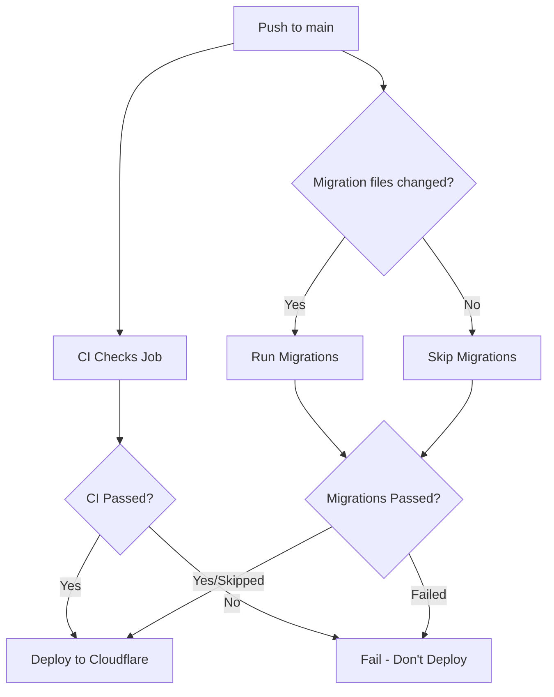

# GitHub Actions Deployment Setup

This document explains the CI/CD pipeline for the 10x-cards project.

## Workflow Overview

### Feature Branches ([feature.yml](.github/workflows/feature.yml))
- **Triggers:** Push to `feature/**` or `feat/**` branches, PRs to `main` or `develop`
- **Jobs:** Lint, test, and build
- **Purpose:** Validate code changes before merging

### Main Branch ([main.yml](.github/workflows/main.yml))
- **Triggers:** Push to `main` branch, manual workflow dispatch
- **Jobs:**
  1. **CI Checks** - Lint, test, and build
  2. **Database Migrations** - Run migrations if `supabase/migrations/**` files changed
  3. **Deploy** - Deploy to Cloudflare Pages after CI and migrations pass
- **Purpose:** Validate, migrate, and deploy production code

## Required GitHub Secrets

You need to configure the following secrets in your GitHub repository:
**Settings → Secrets and variables → Actions → New repository secret**

### Supabase Secrets
- `SUPABASE_URL` - Your Supabase project URL
- `SUPABASE_KEY` - Supabase anon key
- `SUPABASE_SERVICE_ROLE_KEY` - Service role key (for migrations)
- `SUPABASE_PROJECT_REF` - Supabase project reference ID
- `SUPABASE_ACCESS_TOKEN` - Supabase access token for CLI
- `PUBLIC_SUPABASE_URL` - Public Supabase URL (usually same as SUPABASE_URL)
- `PUBLIC_SUPABASE_KEY` - Public Supabase anon key

### Cloudflare Secrets
- `CLOUDFLARE_API_TOKEN` - Cloudflare API token with Pages deployment permissions
- `CLOUDFLARE_ACCOUNT_ID` - Your Cloudflare account ID

### Other Secrets
- `OPENROUTER_API_KEY` - OpenRouter API key for AI features

## GitHub Variables

Configure these as repository variables:
**Settings → Secrets and variables → Actions → Variables tab**

- `OPENROUTER_USE_MOCK` - Set to "true" for testing without real API calls
- `DEFAULT_USER_ID` - Default user ID for development/testing

## How to Get Cloudflare Credentials

### 1. Get Account ID
1. Log in to [Cloudflare Dashboard](https://dash.cloudflare.com/)
2. Go to **Workers & Pages**
3. Your Account ID is displayed on the right side

### 2. Create API Token
1. Go to [API Tokens](https://dash.cloudflare.com/profile/api-tokens)
2. Click **Create Token**
3. Use the **"Edit Cloudflare Workers"** template or create a custom token with:
   - **Account** → **Cloudflare Pages** → **Edit**
4. Click **Continue to summary** → **Create Token**
5. Copy the token (you won't be able to see it again!)
6. Add it to GitHub secrets as `CLOUDFLARE_API_TOKEN`

### 3. Get Supabase Access Token
1. Go to [Supabase Dashboard](https://supabase.com/dashboard)
2. Click your profile icon → **Access Tokens**
3. Click **Generate new token**
4. Give it a name (e.g., "GitHub Actions")
5. Copy the token and add it to GitHub secrets as `SUPABASE_ACCESS_TOKEN`

### 4. Get Supabase Project Reference
1. Go to your Supabase project dashboard
2. Go to **Settings** → **General**
3. Copy the **Reference ID** (format: `abcdefghijklmno`)
4. Add it to GitHub secrets as `SUPABASE_PROJECT_REF`

## Cloudflare Pages Configuration

### Option A: Manual Deployment via GitHub Actions (Recommended)
This is what the new workflow uses. You need to:

1. **Disable automatic deployments** in Cloudflare Pages (if they're enabled):
   - Go to Cloudflare Dashboard → **Workers & Pages**
   - Select your project **10x-cards**
   - Go to **Settings** → **Builds & deployments**
   - Disable **Automatic deployments** from GitHub

2. **Configure environment variables** in Cloudflare Pages:
   - Go to **Settings** → **Environment variables**
   - Add the same variables from [wrangler.toml](../../wrangler.toml):
     - `SUPABASE_URL`
     - `SUPABASE_KEY`
     - `SUPABASE_SERVICE_ROLE_KEY`
     - `DEFAULT_USER_ID`
     - `OPENROUTER_API_KEY`
     - `PUBLIC_SUPABASE_URL`
     - `PUBLIC_SUPABASE_KEY`
   - Mark secrets as **"Encrypt"**

### Option B: Automatic Deployment via Cloudflare (Not Recommended)
If you keep Cloudflare's automatic GitHub integration enabled:
- Deployments will start immediately on push to `main`
- They won't wait for migrations to complete
- This can cause issues if your app depends on new database schema

## How the Workflow Works



### Job Execution Order
1. **CI Checks** and **Migrations** run in parallel
2. **Deploy** waits for both jobs to complete successfully
3. If migrations were skipped (no changes), deployment still proceeds
4. If either CI or migrations fail, deployment is blocked

## Deployment Details

### Project Name
The workflow deploys to a Cloudflare Pages project named **`10x-cards`**.

If your project has a different name in Cloudflare:
1. Check your Cloudflare Pages dashboard for the actual project name
2. Update the deploy command in [main.yml](.github/workflows/main.yml):
   ```yaml
   command: pages deploy dist --project-name=YOUR_PROJECT_NAME --commit-dirty=true
   ```

### Build Output
- The workflow builds the project using `npm run build`
- Output directory: `dist/` (as configured in [wrangler.toml](../../wrangler.toml))
- The built files are deployed to Cloudflare Pages

## Migration Behavior

### When Migrations Run
- Migrations run **only when** files in `supabase/migrations/**` are added or modified
- The workflow checks the commit metadata to detect changes
- Manual workflow dispatch always runs migrations

### Migration Files Detection
The workflow checks:
- `github.event.head_commit.modified` - Modified files in the commit
- `github.event.head_commit.added` - Added files in the commit
- If either contains `supabase/migrations/`, the migration job runs

### Skipping Migrations
If no migration files changed, the migration job is skipped but deployment still proceeds.

## Manual Workflow Trigger

You can manually trigger the workflow:
1. Go to **Actions** tab in GitHub
2. Select **CI/CD - Main Branch**
3. Click **Run workflow**
4. Select the `main` branch
5. Click **Run workflow**

This will:
- Run all CI checks
- Always run migrations (regardless of file changes)
- Deploy if everything passes

## Troubleshooting

### Deployment Fails: "Project not found"
- Check that the project name in the workflow matches your Cloudflare Pages project name
- Verify `CLOUDFLARE_ACCOUNT_ID` is correct

### Migrations Fail: "Project not linked"
- Verify `SUPABASE_PROJECT_REF` matches your project reference ID
- Check that `SUPABASE_ACCESS_TOKEN` has proper permissions

### Deployment Succeeds but Site Doesn't Work
- Check environment variables in Cloudflare Pages dashboard
- Ensure all secrets are properly configured
- Check Cloudflare Pages logs for runtime errors

### Migrations Not Running
- Check if migration files were actually modified in the commit
- Use manual workflow dispatch to force migration run
- Check GitHub Actions logs for conditional evaluation

## Monitoring

### Check Deployment Status
- GitHub Actions: **Actions** tab → **CI/CD - Main Branch**
- Cloudflare Pages: Dashboard → **Workers & Pages** → **10x-cards** → **Deployments**

### Rollback
If deployment breaks production:
1. Go to Cloudflare Pages → **Deployments**
2. Find the last working deployment
3. Click **...** → **Rollback to this deployment**

## Best Practices

1. **Test migrations locally** before pushing to main:
   ```bash
   supabase db push --dry-run
   ```

2. **Use feature branches** for development:
   - Feature branches run CI checks but don't deploy
   - Merge to `main` only when ready for production

3. **Review failed workflows**:
   - Check the Actions tab if deployment fails
   - Fix issues and push again

4. **Keep secrets secure**:
   - Never commit secrets to the repository
   - Rotate tokens periodically
   - Use environment-specific secrets if needed
